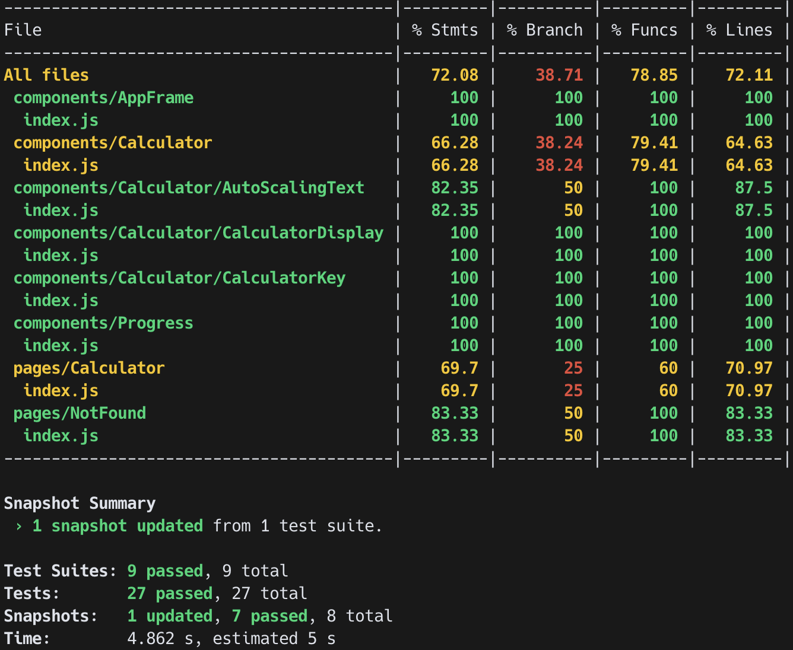

# React Calculator


[](https://codecov.io/gh/tpps88206/calculator)


## Setup

```
$ yarn install
$ yarn start
```

Open [http://localhost:3000](http://localhost:3000) to view it in the browser.

## Technologies

Project is created with:
* Use **React Hook**
* Develop state management with [Redux](https://redux.js.org/) and [Redux Toolkit](https://redux-toolkit.js.org/).
* Develop CSS style with [@material-ui/styles](https://material-ui.com/styles/basics/)
* Develop router management with [React Router](https://github.com/ReactTraining/react-router).
* Use [Material UI](https://material-ui.com/zh/) to generate the beautiful components with Material Design.
* Use **OOCSS** to manage the general CSS style, it is following [Bootstrap](https://getbootstrap.com/).
* Use [react-point](https://github.com/ReactTraining/react-point) to handle touch events.
* Use [react-draggable](https://github.com/STRML/react-draggable) to handle Drag and Drop.
* Use [Lodash](https://lodash.com/) to control logic methods.
* Use [Classnames](https://github.com/JedWatson/classnames) to manage CSS class name.
* Use [Husky](https://typicode.github.io/husky/#/) to handle pre-commit event.
* Define coding style with [Prettier](https://prettier.io/) and **Eslint**.
* Write unit test with **testing-library**.

## Features


## Unit test report


